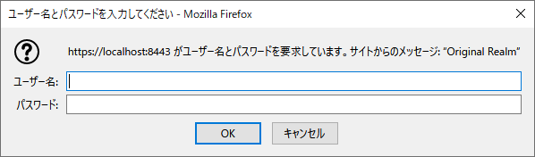
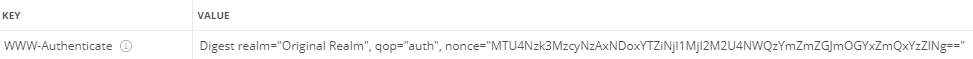

## :leaves: SpringBoot(Rest API)での商品管理アプリ・サンプル
### JPA(O/Rマッピング)を使いデータベースとの読み書き
### RESTful API(JSON)、HTTPS通信
### Spring SecurityのBasic認証を扱う

### 開発環境
```
統合開発環境：JetBrains IntelliJ IDEA Community Edition + Spring Initializr  
プログラム言語：Java 17
開発SDK：Oracle JDK 17.0.5
フレームワーク：Spring Boot 3.0.0
-Spring Framework 6.0.2
-サーブレットエンジン：Apache Tomcat ${tomcatVersion}
-テンプレートエンジン：Thymeleaf 3.1.0
-データベース接続：PostgreSQL JDBC 4.2 Driver 42.5.1
-O/R マッピング フレームワーク：Hibernate ORM 6.1.5.Final + JPA 3.1.0
-ログイン認証:Spring Security 6.0.0  
ログイン認証：Basic認証
データベース：PostgreSQL 15.1  
-データベース管理ツール：PgAdmin 6.17  
ビルドツール： Gradle 7.6 Groovy  
```

<br />

### 変更点
1. Spring Security 6.0で非推奨となったクラスライブラリのコンフィグ系を推奨クラスに移行。
2. ログインユーザーをデータベースから検索し比較するメソッドとテスト用のインメモリーにユーザーを持って比較するプログラム追加。
3. ビルドツールをMavenからGradle(Groovy)に移行。
4. Spring Boot 2.7.xから3.0.xの変更に伴いJava EEも Java EE 8からJakarta EE 9に変更になり、
   O/RマッピングもJava Persistence APIからJakarta Persistence APIに移行
5. 設定ファイルをプロパティファイルからymlファイルに移行。  
   データリソース用のデータベースが変わっても設定ファイルを切り替えるだけで別のデータソースへ切り替わるようyml編集。

<br />

## 2. 事前準備
### サンプルプログラムを実行する際のデータベース作成
PostgreSQLのクエリーやpgAdminのクエリーツールで以下のSQLを実行するかこれ相当をpgAdminなどの管理ツールのデータベース作成で作成します。

#### データベース作成(pgAdminでのデフォルト相当)
データベース名は`SpringBootPostgres`です。

```
-- Database: SpringBootPostgres

-- DROP DATABASE IF EXISTS "SpringBootPostgres";

CREATE DATABASE "SpringBootPostgres"
    WITH 
    OWNER = postgres
    ENCODING = 'UTF8'
    LC_COLLATE = 'Japanese_Japan.932'
    LC_CTYPE = 'Japanese_Japan.932'
    TABLESPACE = pg_default
    CONNECTION LIMIT = -1;
````

#### テーブル作成およびサンプルデータ
SpringJpaの機能および設定によりテーブルが無ければ作成しますので必要ありません。  
サンプルデータもデータが１件も無ければプログラムにより作成するようになっていますので必要ありません。


<br />

#### Digest認証／ブラウザ  


#### Digest認証／401レスポンスヘッダー例  
